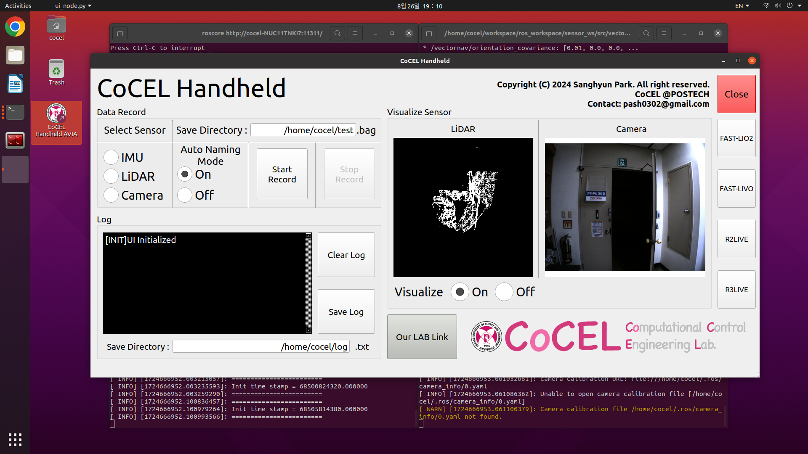

# CoCEL_Handheld_DataRecorder
CoCEL Handheld data recording program with **Touch UI**  
  
[Hardware Design]()  

[System Firmware](https://github.com/SanghyunPark01/CoCEL_Handheld_Software)  
  
=============================  

**Hardware Design will be uploaded**  
  
=============================  

## One Touch UI
**Example**

**Function**
- Select Sensor: You can select the sensor you want to record.  
- Auto Naming Mode: When `On`, automatically generates a name when data is saved.(You don't need to write your name on the keyboard!)  
- Start & End Record button: Click the `Start Record` button to start recording the data(rosbag) and click the `End button` to stop recording and save it.  
- Visualize: Visualize LiDAR & Camera.  

## Contact
- E-mail: pash0302@postech.ac.kr
- E-mail: pash0302@gmail.com