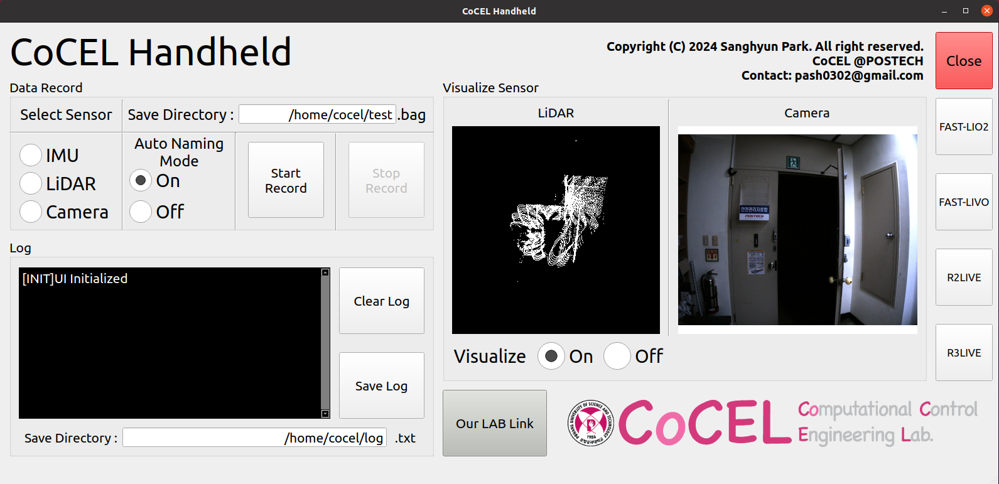
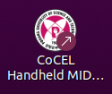
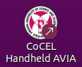

# CoCEL_Handheld_DataRecorder
CoCEL Handheld data recording program with **Touch UI**  

[Handheld Driver](https://github.com/SanghyunPark01/CoCEL_Handheld_Driver)  
  
[Video](https://www.youtube.com/watch?v=Me2jOfhErLY)
  
======================================  

**Hardware Design in [Handheld Driver](https://github.com/SanghyunPark01/CoCEL_Handheld_Driver)**  
  
======================================  

## One Touch UI
**Example**

**Function**
- Select Sensor: You can select the sensor you want to record.  
- Auto Naming Mode: When `On`, automatically generates a name when data is saved.(You don't need to write your name using keyboard!)  
- Start & End Record button: Click the `Start Record` button to start recording the data(rosbag) and click the `End button` to stop recording and save it.  
- Visualize: Visualize LiDAR & Camera.  
- (New) SLAM: Click Button to Run SLAM!!

## Application

    
    

  

You can use the `.desktop` file to make it an **application**.

## Contact
- E-mail: pash0302@postech.ac.kr
- E-mail: pash0302@gmail.com
